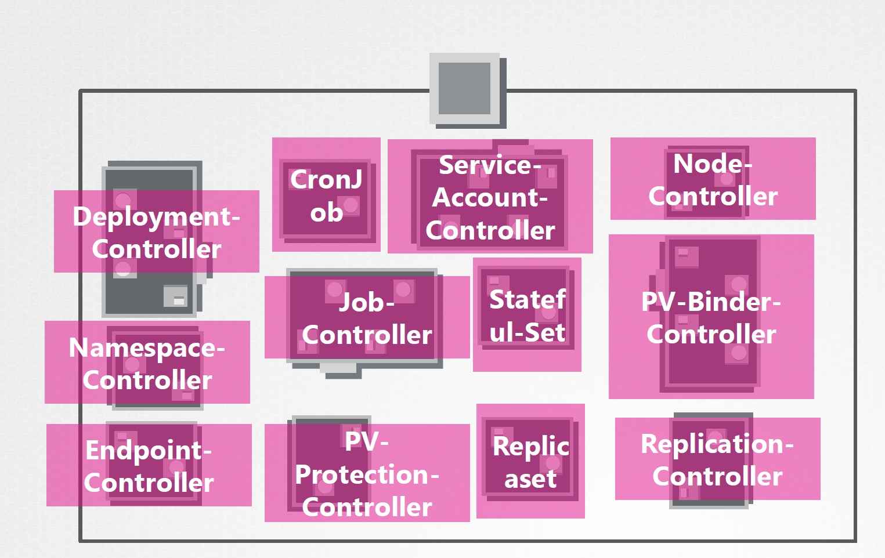

# Playbook Part 0 : Shortcuts

In Kubernetes, when you run a kubectl command, the kubectl utility is in fact reaching to the Kube-apiserver. The Kube-api server first authentificates and validates requests. It then retrives and updates data from in ETCD data store and responds back with the requested information. ( In fact, kube-api server is the only component that interacts directly with the etcd data store, the other components such as the scheduler, kube-controller-manager & kubelet users the API Server to perform updates in the cluster in their respective areas )

### Play 0 : How it works ? 

Recap : Authenticate User ==> Validate Request ==> Retrieve data==> update ETCD => Scheduler ==> Kubelet )

Instead of using kubectl, you could also invoke the API directly by sending a post request. In this case the API server creates a pod object without assigning it to a node, updates the information in the etcd server, updates the user that the pod has been created. The scheduler continously monitors the API server and realizes that there is a new pod with no node assigned the scheduler identifies the right node to place the new pod on and communicates that back to the kube-apiserver. Then the API server then updates the information in the ETCD cluster. The API Server then passes that information to the kubelet in appriopriate worker node. The kubelet then creates the pod on the node and instructs the container runtime engine to deploy the application image. Once done, the kubelet updates the status back to the API server and the API server then updates the data bak in the etcd cluster. A similar pattern is followed every time a change is requested. The kube-apiserver is at the center of all the different tasks that needs to be performed to make a change in cluster. 

A kube-controller-manager is a component that continously monitors the state of various components within the system and works towards bringing the whole system to the desired functioning state.  ( watch status, remediate situation ), by checking the content : 

      cat /etc/kubernetes/manifests/kube-controller-manager.yaml

View controller manager options : 

      cat /etc/systemd/system/kube-controller-manager.service

      ps -aux | grep kube-controller-manager

Here are all the controllers in kube-controller-manager:

### Play 1. Basics :

Set up alias : 

    alias k=kubectl
    
Set up auto-completion : 

    echo "source <(kubectl completion bash)" >> ~/.bashrc

Display nodes:

    Kubectl get nodes
    
is equal to :
  
    k get no

Get everything : 

    kubectl get all 

List all the events in the current namespace : 

    kubectl get events

Display services:

     kubectl get services
     
is equal to :

     k get svc
     
Display deployments :

     kubectl get deployments 
     
is equal to :

     k get deploy

### Play 2. Add flags
In all namespaces : 

    --all-namespaces  

Display labels :

    --show-labels  
    
Display more information :

    -o wide
   
Output as yaml format :

    -o yaml

Sort by name : 

    --sort-by=.metadata.name

Sort by capacity :

    --sort-by=.spec.capacity.storage  
   
 By default as soon as the command is run, the resource will be created. If you simply want to test your command, use the following :
 
   --dry-run 
   
as option. This will not create the resource, instead, tell you weather the resource can be created and if your command is right.
   

### Play 3. Write spec to a file 

Get pod spec to a folder / file location : 

    kubectl get deploy kubedeploy -o yaml >> prep/test.yaml

### Play 4. Testing rolling updates

Using the following bash scripts : 

    while true; do curl http://<ip-address-of-the-service>; done
