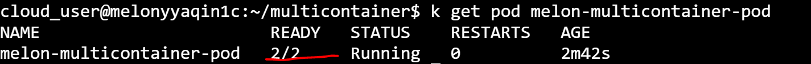

# Playbook Part 1 : Pods and deployments

### Play 1 : Pod Design - Multi-container Pods

## Basics

Multi-container pods are simply pods with more than one container that are working together and sort of forming a single unit. It is often a good idea to keep containers separate by keeping them in their own separate pods, but there are several cases where multi-container pods can be beneficial. 

## How your container interact with one another

A container can interact with one another in three ways :
- Share **Network**. It is like two containers were running on the same host, they can access each other simply using localhost. All listening ports are accessible to other containers in the pod even if they're not exposed outside the pod. 


- Shared **Storage Volumes**. We can mount the same volume to two different containers so that they can both interact with the same files so you could have one container outputting files to the volume and the other container reading them or you could have both of them reading and writing files to that same volume. 


- Shared **Process Namespace**. Essentially what this does is it allows the two containers to signal one another's processes. In order to implement that, you have to add an attribute to your pod back called **shareProcessNamespace** and set that to **true**. Once that is set to true, your containers can actually interact directly with one another's processes using a shared process namespace.


## Multi-container pod design pattern

Three multi-container pod design pattern :
- **sidecar** Pattern uses a sidecar container that enhances the functionality of the main container. Example: A sidecar container that sinks files from a git repository to the file system of a web server container. Every two minutes checks for new version of these files. If the files have been updated, it pulls in the new files and pushes them into the file system of the main container, so they're automatically updated without even having to restart or redeploy that container.

- **ambassador**
- **adaptor**


Multi-container example: 

```yaml
   apiVersion: v1
   kind: Pod
   metadata:
     name: melon-multicontainer-pod
     labels:
       app: melon-multiapp
   spec:
     containers:
     - name: nginx
       image: nginx
       ports:
       - containerPort: 80
     - name: busybox-sidecar
       image: busybox
       command: ['sh', '-c', 'while true; do sleep 3600; done;']
 ```

After creating the pod, you can use kubectl command to check the status of pod to see if it is up and running, you'll have a output similar as following and you see it's Ready 2/2: 




### Play 2 : Manage namespaces

Get all namespaces using the following : 

    kubectl get namespaces
  
Create a namespace by using the following : 
    
    kubectl create ns melon-ns


Or use the yaml definition : 

 ```yaml
   apiVersion: v1
   kind: Pod
   metadata:
    name: melon-ns-pod
    namespace: melon-ns
    labels:
      app: melonapp
   spec:
    containers:
    - name: melonapp-container
      image: busybox
      command: ['sh', '-c', 'echo Salut K8S! && sleep 3600']
   
 ```

Get namespace : 

    kubectl get pods -n melon-ms


Check pod by namespaces : 

    Kubectl describe pod melon-ms-pod -n melon-ms


### Play 3 : Manage deployments

Run Busybox image : 

    kubectl run busybox --rm -it --image=busybox /bin/sh
    
Run nginx image : 

    kubectl run nginx --image=nginx --dry-run -o yaml > pod-sample.yaml

Create a deployment using the following : 

    kubectl create deployment kubeserve --image=nginx:1.7.8

Scale a deployment using the following : 

    kubectl scale deployment kubeserve --replicas=5
    


    
    
    
