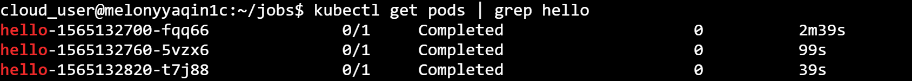
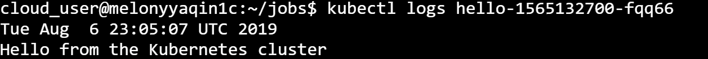

# Playbook Part 1 : Pods and deployments

## Play 1 : Pod Design - Multi-container Pods

### Basics

Multi-container pods are simply pods with more than one container that are working together and sort of forming a single unit. It is often a good idea to keep containers separate by keeping them in their own separate pods, but there are several cases where multi-container pods can be beneficial. 

### How your container interact with one another

A container can interact with one another in three ways :
- Share **Network**. It is like two containers were running on the same host, they can access each other simply using localhost. All listening ports are accessible to other containers in the pod even if they're not exposed outside the pod. 


- Shared **Storage Volumes**. We can mount the same volume to two different containers so that they can both interact with the same files so you could have one container outputting files to the volume and the other container reading them or you could have both of them reading and writing files to that same volume. 

C:\Users\melqin\Documents\00 - GitHub\melonkube\screenshots

- Shared **Process Namespace**. Essentially what this does is it allows the two containers to signal one another's processes. In order to implement that, you have to add an attribute to your pod back called **shareProcessNamespace** and set that to **true**. Once that is set to true, your containers can actually interact directly with one another's processes using a shared process namespace.


## Play 2 : Multi-container pod design pattern

Three multi-container pod design pattern :
- **sidecar** pattern uses a sidecar container that enhances the functionality of the main container. Example: A sidecar container that sinks files from a git repository to the file system of a web server container. Every two minutes checks for new version of these files. If the files have been updated, it pulls in the new files and pushes them into the file system of the main container, so they're automatically updated without even having to restart or redeploy that container.

- **ambassador** pattern is all about capturing and translating networking traffics. One of the examples would be an container that listens on a custom port and forward traffic to the main container on an hardcoded port when deploying some legacy applications, to solve that problem, you can simply by forwarding the traffic from one port to another use ambassador pattern.  

- **adaptor** pattern is all about transforming the output from the main container in some way in order to adapt it to some other type of system. An example could be that we have the output from the main container and adaptor container is formatting or chaning the output and then making that output available outside of pod itself. So one of the common use cases for this is if you have some kind of log analyzer, something like Prometheus or log stash, you can use the adaptor container to apply specific formating to those logs and allow them to be pushed or pulled to some kind of external system. 


Multi-container example: 

```yaml
   apiVersion: v1
   kind: Pod
   metadata:
     name: melon-multicontainer-pod
     labels:
       app: melon-multiapp
   spec:
     containers:
     - name: nginx
       image: nginx
       ports:
       - containerPort: 80
     - name: busybox-sidecar
       image: busybox
       command: ['sh', '-c', 'while true; do sleep 3600; done;']
 ```

After creating the pod, you can use kubectl command to check the status of pod to see if it is up and running, you'll have a output similar as following and you see it's Ready 2/2: 


## Play 3 : Manage namespaces

Get all namespaces using the following : 

    kubectl get namespaces
  
Create a namespace by using the following : 
    
    kubectl create ns melon-ns


Or use the yaml definition : 

 ```yaml
   apiVersion: v1
   kind: Pod
   metadata:
    name: melon-ns-pod
    namespace: melon-ns
    labels:
      app: melonapp
   spec:
    containers:
    - name: melonapp-container
      image: busybox
      command: ['sh', '-c', 'echo Salut K8S! && sleep 3600']
   
 ```

Get namespace : 

    kubectl get pods -n melon-ms


Check pod by namespaces : 

    Kubectl describe pod melon-ms-pod -n melon-ms


## Play 4 : Manage deployments

**Deployments** provide a way to define a desired state for the replica pod.

You can use the yaml defined template to define a deloyment : 
```yaml
apiVersion: apps/v1
kind: Deployment
metadata:
  name: melon-deploy
  labels:
    app: melonapp
spec:
  replicas : 3
  selector:
    matchLabels:
      app: melonapp
  template:
    metadata:
      labels:
        app: melonapp
    spec:
      containers:
      - name: nginx
        image: nginx
        ports:
        - containerPort: 80

 ```

 Above yaml manifest means :

 - **spec.replicas** is the number of replica pods
 - **spec.template** is the template pod descriptor which defines the pods which will be created
 - **spec.selector** is the deployment will manage all pods whose labels match this selector

Run Busybox image : 

    kubectl run busybox --rm -it --image=busybox /bin/sh
    
Run nginx image : 

    kubectl run nginx --image=nginx --dry-run -o yaml > pod-sample.yaml

Create a deployment using the following : 

    kubectl create deployment kubeserve --image=nginx:1.7.8

Scale a deployment using the following : 

    kubectl scale deployment kubeserve --replicas=5
    

Other useful command about query, edit, and delete deployment :
    
    kubectl get deployments

    kubectl get deployment melon-deploy

    kubectl describe deployment melon-deploy

    kubectl edit deployment melon-deploy

    kubectl delete deployment melon-deploy


## Play 4 : Jobs and CronJobs

Jobs can be used to reliably execute a workload until it completes. The job will create one or more pods. When the job is finished, the containers will exit and the pods will enter the **Completed** status. The example of using jobs is when we want to run a particular workload and just to make sure it runs once and succeeds.

You can create a job through Yaml descriptor : 

 ```yaml
   apiVersion: batch/v1
   kind: Job
   metadata:
    name: melon-job
   spec:
    template:
      spec:
        containers:
        - name: melonapp-job
          image: perl
          command: ["perl", "-Mbignum=bpi", "-wle","print bpi(2000)"]
        restartPolicy: Never
    backoffLimit: 4
 ```
    
If it is failed until 4 times, it is not gonna to continue. All the job really does is it creates a pod behind the scenes, but instead of a normal pod that's constantly running, it's a pod that runs and when it's complete it goes into the completed status. Which means the container is no longer running, so the pod still exists, but the container is completed. 
    
You can run the following command to check the job status: 

     kubectl get job

When the job is still running you can see the status as the following


When the job is finished you can see the job has been completed.


CronJobs build upon the functionality of job by allowing you to execute jobs on a schedule ( based on a cron expression ). 

 ```yaml
apiVersion: batch/v1beta1
kind: CronJob
metadata:
  name: hello
spec:
  schedule: "*/1 * * * *"
  jobTemplate:
    spec:
      template:
        spec:
          containers:
          - name: hello
            image: busybox
            args:
            - /bin/sh
            - -c
            - date; echo Hello from the Kubernetes cluster
          restartPolicy: OnFailure
 ```

 You can use the following command to check the cron job: 

     kubectl get cronjob

You'll have a output like the following :

 

 You can also use the command to check the log of job ( basically the same with pod ), by firstly checking the pods status: 

     kubectl get pods | grep hello

You'll have a output like the following :

 

Then :

   kubectl logs hello-xxxx

You'll see you can virtualise the cron job has been executed :

 


 ## Play 5 : Labels, Selectors, and Annotations

 **Labels** are key-value pairs attached to Kubernetes objects, we can list them in metadata.labels section of an object descriptor. 

**Selectors** are used for identifying and selecting a group of objects using their labels. 

Examples of **quality-based** selectors: 

      kubectl get pods -l app=my-app

      kubectl get pods -l environment=production

Example of **inequality** :

      kubectl get pods -l environment!=production

Example of **set-based** selectors

      kubectl get pods -l 'environment in (production,development)'

Example of chaining multiple selectors together using a **comma-delimited** list : 

      kubectl get pods -l app=myapp.environment=production 

**Annotation** are similar to labels in that they can be used to store custom metatdata about objects. However, **cannot** be used to select or group objects in Kubernetes.  We can attach annotations to objects using the metadata.annotations sector or the object descriptor

 ## Play 6 : Resource requirements

 Kubernetes allows us to specify the resource requirements of a container in the pod spec. 

 **Resource Request** means the amount of resources that are necessary to run a container, and what they do is they govern which worker node the containers will actually be scheduled on. So when Kubernetes is getting ready to run a particuler pod, it's going to choose a worker node based on the resource requests of that pod's contianers. And Kubernetes will use those values to ensure that it chooses a node that actually has enough resoruces available to run that pod.  A pod will only be a run on a node that has enough available resource to run the pod's containers. 

**Resource Limit** defines a maximum value for the resource usage of a container. And if the container goes above that maximum value than it's likely to be killed or restarted by the Kubernetes cluster. So resource limits just provided a way to kind of put some constraints around, how much resource is your containers are allowed to use and prevent certain containers from just comsuming a whole bunch of resource is and running away with all the resoruces in your cluster, potentially cause issues for other containers and applications as well. 

 ```yaml
apiVersion: v1
kind: Pod
metadata:
  name: melonapp-pod
spec:
  containers:
  - name: melonapp-container
    image: busybox
    command: ['sh', '-c', 'echo stay tuned! && sleep 3600']
    resources:
      requests:
        memory: "64Mi"   # 64 Megabytes
        cpu: "250m"  #250em means 250 millis CPUs is 1 1/1000 of a CPU or 0.25 CPU cores ( 1/4 one quarter of CPU cores)
      limits:
        memory: "128Mi"
        cpu: "500m"

  ```