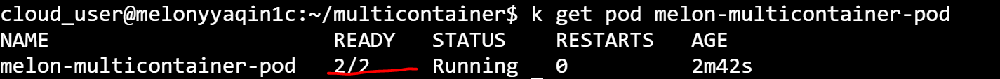
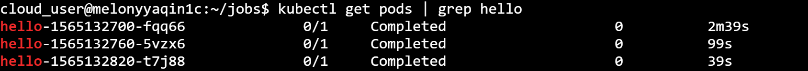
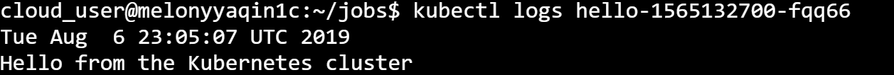

# Playbook Part 1 : Pods design

**Kubelet** is like a captain of your ship, it registers the node, and create pod in worker node and monitors nodes and pods on a timely basis. 

There two ways to create pod by Kubelet :

- From static pod path ( which is known as the static pods )
- Through an HTTP API endpoint which is kube-apiserver ( the pods from the api-server )

## Play 1 : Static Pod

The kubelet can manage a node independently, it can create pods ( but need API server to provide pod details ), the question here is how do we provide a pod definition file to the kubelet without a kube-api server ? 

You can configure the kubelet to read the pod definition files from a directory on the server designated to store information of pods. Which is like the following : 

      /etc/kubernetes/manifests

Kubelet check this directory periodically reads these files and creates pods on the host. Not only does it create the pod it can ensure that the pod stays alive. If the application crashed, the kubelet attempts to restart it. If you make a change to any of the file within this directory, the kubelet recreates the pod for those changes to take effect. If you remove a file from this directory the pod is deleted automatically. So these pods that are created by the kubelet on its own without the intervention from the API server or the rest of the Kubernetes cluster components are known as **static pods**. Remember this is only apply for **Pod**, no daemonsets and replicatsets as those need to interact with other parts of Kubernetes cluster.

This path can be configured as the following in **kubelet.service**: 

      --pod-manifest-path=/etc/Kubernetes/manifests

Or using the **--config** option :

      --config=kubeconfig.yaml

then in **kubeconfig.yaml** file :

      staticPodPath : /etc/kubernetes/manifests

Once the static pod has been created, you can use **docker ps** command to review it. The reason why not the kubectl command is we don't have the rest of the Kubernetes cluster. Kubectl utility works with kube-api server. 

In this case the kube-apiserver will still be aware of the static pod has been created later on, as after kubelet create the pod, it also creates a mirror object in the kube-apiserver. so if you use **kubectl get pods**, what you see here is just a read-only mirror of the pod, which means you can view details of the pod but you cannot edit or delete it like the usual pods ( you can only delete them by modifying the files from the nodes manifest folder ).

Use case of static pod is to deploy control plane components itself as pods on a node, start by installing kubelet on all the master node then create pod definition files that uses docker images of the various control plane components such as the api server, controller, etcd etc. Place the definition files in the designated manifests folder and kubelet takes care of deploying the control plane components themselves as pods on the cluster. This way you don't have to download the binaries configure services or worry about if these services crash if any of these services were to crash since it's a static pod it will automatically be restarted by kubelet. That is how the **kubeadm** tool set up the cluster. 

You can use the following command to set up the pods bootstrapped by kubeadm : 

      kubectl get pods -n kube-system


## Play 2 : Pod Design - Multi-container Pods

In general, it is good to have a one-to-one relationship between container and pod. 

create a pod using imperative command like the following : 

    kubectl run --generator=run-pod/v1 nginx-pod --image=nginx:alpine

### Basics

Multi-container pods are simply pods with more than one container that are working together and sort of forming a single unit. It is often a good idea to keep containers separate by keeping them in their own separate pods, but there are several cases where multi-container pods can be beneficial. 

### How your container interact with one another

A container can interact with one another in three ways :
- Share **Network**. It is like two containers were running on the same host, they can access each other simply using localhost. All listening ports are accessible to other containers in the pod even if they're not exposed outside the pod. 


- Shared **Storage Volumes**. We can mount the same volume to two different containers so that they can both interact with the same files so you could have one container outputting files to the volume and the other container reading them or you could have both of them reading and writing files to that same volume. 

C:\Users\melqin\Documents\00 - GitHub\melonkube\screenshots

- Shared **Process Namespace**. Essentially what this does is it allows the two containers to signal one another's processes. In order to implement that, you have to add an attribute to your pod back called **shareProcessNamespace** and set that to **true**. Once that is set to true, your containers can actually interact directly with one another's processes using a shared process namespace.


### Replication controller & Replicas Set

Replication controller spans across multiple nodes in the cluster. It helps us balance the load across multiple pods on different nodes as well as scale our application when demand increases. 

**ReplicaSet** is the new generation to help pods achieve higher availability. We can ensure we'll always have a certain number defined replicas at a time. The role of the replicaset is to monitor the pods and if any of them were to fail, deploy new ones. There could be 100s of other pods in the cluster running different applications. This is where labelling our pods during creation comes in handy. We could now provide these labels as a filter for replicaset. Under the selector section we use to match labels filter and provide the same label we used while creating the pods. 


```yaml
apiVersion: apps/v1
kind: ReplicaSet
metadata:
  name: frontend
  labels:
    app: melonapp-rs
spec:
  replicas: 3
  selector:
    matchLabels:
      app: melonapp-rs
  template:
    metadata:
      labels:
        app: melonapp-rs
    spec:
      containers:
      - name: nginx
        image: nginx
 ```

The **matchLabels** selector simply matches the labels specified under it to the labels on the pods.

To check your replicas set, using the following command : 

      kubectl get replicaset

Or 

      kubectl get rs

To update the number of replicasset there are two ways :

1. Update the **replicas: 3** to specific number **replicas:6** for example

2. Use the following command : 

   kubectl scale replicaset melon-rs --replicas=6

Or combine the spec : 

   kubectl scale --replicas=6 -f melon-rs-spec.yaml

Delete the replicaset is the following command:

   kubectl delete replicaset melon-rs

### Daemon Sets

Previsouly, we've talked about with the help of replicasets and deployments we make sure multiple copies of our applications are made available across various different worker nodes. Daemonsets like replicaset but it runs one copye your pod on each node in your cluster. Whenever a new node is added to the cluster a replica of the pod is automatically added to that node and when a node is removed the pod is automatically removed. 

The key thing to define daemonset is it ensures that one copy of the pod is always present in all nodes in the cluster. ( Ignored by kube-scheduler )

DaemonSets do not use a scheduler to deploy pods. When you need to run 1 replicas and exactly 1 on each node, daemonset is a perfect match.  As nodes are removed from the cluster, those Pods are garbage collected.

The main use cases of daemonsets is that you can deploy the following component to monitor your cluster better : 

- Monitoring agent 
- Logs collector 

Then you don't have to worry about adding / removing monitoring agents from these nodes when there are changes in your cluster. For example, the kube-proxy can be deployed as a daemonset in your cluster and another example is for networking. Networking solutions like WeaveNet requires an agent to be deployed on each node in the cluster. 


```yaml
apiVersion: apps/v1
kind: DaemonSet
metadata:
  name: monitoring-daemon
spec:
  selector:
    matchLabels:
      name: monitoring-agent
  template:
    metadata:
      labels:
        name: monitoring-agent
    spec:
      containers:
      - name: monitoring-agent
        image: monitoring-agent
  ```    
      
To check daemonset has been created use the following : 

     kubectl get daemonsets

It also means we can simplify the command like the following : 

     kubectl get ds 

Which also reminds us to check the details of daemonset by using :

     kubectl describe daemonsets montoring-daemon


## Play 3 : Multi-container pod design pattern

Three multi-container pod design pattern :
- **sidecar** pattern uses a sidecar container that enhances the functionality of the main container. Example: A sidecar container that sinks files from a git repository to the file system of a web server container. Every two minutes checks for new version of these files. If the files have been updated, it pulls in the new files and pushes them into the file system of the main container, so they're automatically updated without even having to restart or redeploy that container.

- **ambassador** pattern is all about capturing and translating networking traffics. One of the examples would be an container that listens on a custom port and forward traffic to the main container on an hardcoded port when deploying some legacy applications, to solve that problem, you can simply by forwarding the traffic from one port to another use ambassador pattern.  

- **adaptor** pattern is all about transforming the output from the main container in some way in order to adapt it to some other type of system. An example could be that we have the output from the main container and adaptor container is formatting or chaning the output and then making that output available outside of pod itself. So one of the common use cases for this is if you have some kind of log analyzer, something like Prometheus or log stash, you can use the adaptor container to apply specific formating to those logs and allow them to be pushed or pulled to some kind of external system. 


Multi-container example: 

```yaml
   apiVersion: v1
   kind: Pod
   metadata:
     name: melon-multicontainer-pod
     labels:
       app: melon-multiapp
   spec:
     containers:
     - name: nginx
       image: nginx
       ports:
       - containerPort: 80
     - name: busybox-sidecar
       image: busybox
       command: ['sh', '-c', 'while true; do sleep 3600; done;']
 ```

After creating the pod, you can use kubectl command to check the status of pod to see if it is up and running, you'll have a output similar as following and you see it's Ready 2/2: 




## Play 4 : Manage namespaces

Default namespaces created by Kubernetes : kube-system, default and kube-public.


Get all namespaces using the following : 

    kubectl get namespaces
  
Create a namespace by using the following : 
    
    kubectl create ns melon-ns


Or use the yaml definition : 

 ```yaml
   apiVersion: v1
   kind: Pod
   metadata:
    name: melon-ns-pod
    namespace: melon-ns
    labels:
      app: melonapp
   spec:
    containers:
    - name: melonapp-container
      image: busybox
      command: ['sh', '-c', 'echo Salut K8S! && sleep 3600']
   
 ```

Get namespace : 

    kubectl get pods -n melon-ms


Check pod by namespaces : 

    Kubectl describe pod melon-ms-pod -n melon-ms


We have to use the namespace option if the pods are not in default namespace, but what if we want to switch the dev namespace permanently so that we don't have to specify the namespace option any more. You can use the following to do this : 

    kubectl config set-context &(kubectl config current-context) --namespace=dev

You can then simply run the following command without the namespace option to list pods : 
 
    kubetl get pods


## Play 5 : Jobs and CronJobs

Jobs can be used to reliably execute a workload until it completes. The job will create one or more pods. When the job is finished, the containers will exit and the pods will enter the **Completed** status. The example of using jobs is when we want to run a particular workload and just to make sure it runs once and succeeds.

You can create a job through Yaml descriptor : 

 ```yaml
   apiVersion: batch/v1
   kind: Job
   metadata:
    name: melon-job
   spec:
    template:
      spec:
        containers:
        - name: melonapp-job
          image: perl
          command: ["perl", "-Mbignum=bpi", "-wle","print bpi(2000)"]
        restartPolicy: Never
    backoffLimit: 4
 ```
    
If it is failed until 4 times, it is not gonna to continue. All the job really does is it creates a pod behind the scenes, but instead of a normal pod that's constantly running, it's a pod that runs and when it's complete it goes into the completed status. Which means the container is no longer running, so the pod still exists, but the container is completed. 
    
You can run the following command to check the job status: 

     kubectl get job

When the job is still running you can see the status as the following


When the job is finished you can see the job has been completed.


CronJobs build upon the functionality of job by allowing you to execute jobs on a schedule ( based on a cron expression ). 

 ```yaml
apiVersion: batch/v1beta1
kind: CronJob
metadata:
  name: hello
spec:
  schedule: "*/1 * * * *"
  jobTemplate:
    spec:
      template:
        spec:
          containers:
          - name: hello
            image: busybox
            args:
            - /bin/sh
            - -c
            - date; echo Hello from the Kubernetes cluster
          restartPolicy: OnFailure
 ```

 You can use the following command to check the cron job: 

     kubectl get cronjob

You'll have a output like the following :

 

 You can also use the command to check the log of job ( basically the same with pod ), by firstly checking the pods status: 

     kubectl get pods | grep hello

You'll have a output like the following :

 

Then :

   kubectl logs hello-xxxx

You'll see you can virtualise the cron job has been executed :

 


## Play 6 : Labels, Selectors, and Annotations

**Labels** are key-value pairs attached to Kubernetes objects, we can list them in metadata.labels section of an object descriptor. 

**Selectors** are used for identifying and selecting a group of objects using their labels. 

Examples of **quality-based** selectors: 

      kubectl get pods -l app=my-app

      kubectl get pods -l environment=production

Example of **inequality** :

      kubectl get pods -l environment!=production

Example of **set-based** selectors

      kubectl get pods -l 'environment in (production,development)'

Example of chaining multiple selectors together using a **comma-delimited** list : 

      kubectl get pods -l app=myapp.environment=production 

**Annotation** are similar to labels in that they can be used to store custom metadata about objects. However, **cannot** be used to select or group objects in Kubernetes.  We can attach annotations to objects using the metadata.annotations sector or the object descriptor

 ## Play 7 : Resource requirements

 Kubernetes allows us to specify the resource requirements of a container in the pod spec. 

 **Resource Request** means the amount of resources that are necessary to run a container, and what they do is they govern which worker node the containers will actually be scheduled on. So when Kubernetes is getting ready to run a particuler pod, it's going to choose a worker node based on the resource requests of that pod's contianers. And Kubernetes will use those values to ensure that it chooses a node that actually has enough resoruces available to run that pod.  A pod will only be a run on a node that has enough available resource to run the pod's containers. 

**Resource Limit** defines a maximum value for the resource usage of a container. And if the container goes above that maximum value than it's likely to be killed or restarted by the Kubernetes cluster. So resource limits just provided a way to kind of put some constraints around, how much resource is your containers are allowed to use and prevent certain containers from just comsuming a whole bunch of resource is and running away with all the resoruces in your cluster, potentially cause issues for other containers and applications as well. 

 ```yaml
apiVersion: v1
kind: Pod
metadata:
  name: melonapp-pod
spec:
  containers:
  - name: melonapp-container
    image: busybox
    command: ['sh', '-c', 'echo stay tuned! && sleep 3600']
    resources:
      requests:
        memory: "64Mi"   # 64 Megabytes
        cpu: "250m"  #250em means 250 millis CPUs is 1 1/1000 of a CPU or 0.25 CPU cores ( 1/4 one quarter of CPU cores)
      limits:
        memory: "128Mi"
        cpu: "500m"

  ```

  
By default : 1vCPU and 512Mi, if you don't like the default limit you canchange them by adding a limit section under the resources.  Remember that the limits and requests are set for each container within the pod

You can refer the following diagram to gain better vision : 

  

So what happens when a pod tries to exceed resources beyond its specified limit :
- A container cannot use more CPU resources than its limit.
- However, it can use more memory resource than its limit
So if a pod tries to consume more memory than its limit constantly, the pod will be terminated.

**Resource quota** provides constraints that limit aggregate resource consumption per namespace.

 ```yaml
  apiVersion: v1
  kind: ResourceQuota
  metadata:
    name: melon-pods
    namespace: melon-ns
  spec:
    hard:
      cpu: "5"
      memory: 10Gi
      pods: "10"
  ```


## Play 8 : Manual Scheduling

You can constrain a Pod to only be able to run on particular Node(s) , or to prefer to run on particular nodes. There are several ways to do this, and the recommended approaches all use label selectors to make the selection. Generally such constraints are unnecessary, as the scheduler will automatically do a reasonable placement (e.g. spread your pods across nodes, not place the pod on a node with insufficient free resources, etc.) but there are some circumstances where you may want more control on a node where a pod lands, e.g. to ensure that a pod ends up on a machine with an SSD attached to it, or to co-locate pods from two different services that communicate a lot into the same availability zone.
 

```yaml  
apiVersion: v1
kind: Pod
metadata:
  name: nginx
spec:
  containers:
  - name: nginx
    image: nginx
  nodeName: melonnode
  ```

  Ref : https://kubernetes.io/docs/concepts/configuration/assign-pod-node/

  The way that we could set the nodeName property on the pod to bypass the scheduler and get the pod placed on a node directly in the specification before it is creatd and when they are created, they automatically land on the respective nodes. So that's how it used to be until Kubernetes version **v1.12**. From v.12 onwards, such as daemonset uses the default scheduler and **node affinity rules** to schedule pods on nodes. 


