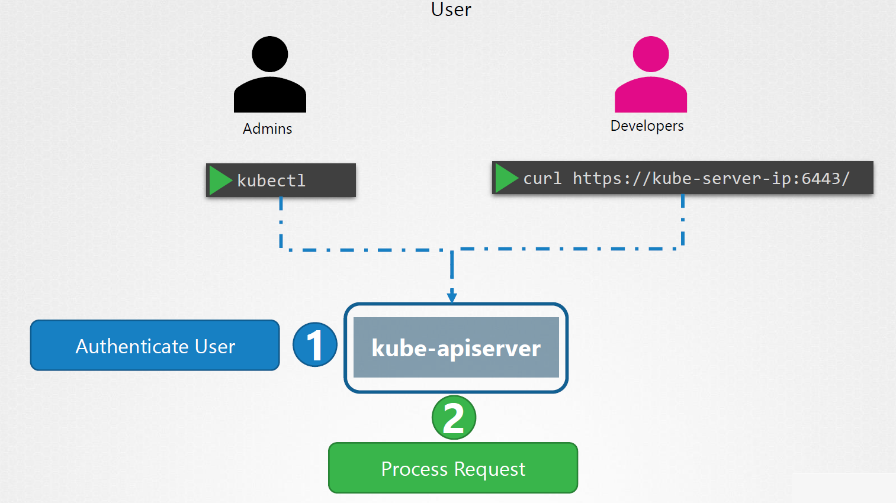
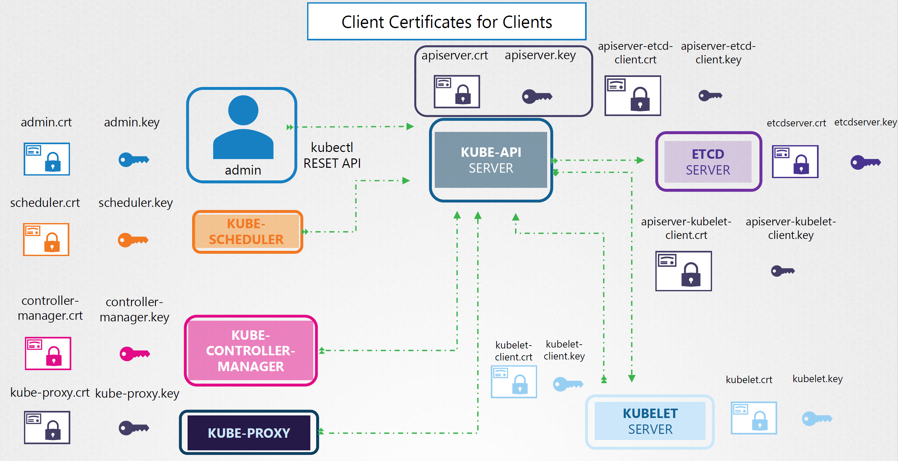

# Playbook Part 9: Security

How does someone gain access to the Kubernetes Cluster and how are their actions being controlled at a high level. 

### Play 0 : Overview of Security 

This section explains :
- What are the risks ?
- What measures do you need to take to secure the cluster ?

From the viewpoint of architecture, the kube-api server is at the center of all operations within Kubernetes. You can perform all operation to interact with it, this also means it is the first line of defense of Kubernetes. Two types of questions leveraging here : 

#### Before starting :

- Who can access the cluster ? 
  This can be answer by : 
   - Files - Username and Passwords
   - Files - Username and Tokens
   - Certificates
   - External Authentification providers - LDAP
   - Service Accounts ( non-humain party )

- What can they do ? 
 This can be answer by :
   - RBAC Authorization
   - ABAC Authorization
   - Node Authorization
   - Webhook Mode 

Another thing is inside Kubernetes Cluster, the communication among each components such as ETCD cluster, Kubelet, Kube-proxy, Kube Scheduler, Kube Controller Manager, and Kube API Server is secured using TLS Encryption. 

#### How it works ? 
You can access the cluster through kubectl tool or the API directly, all of these requests go through the Kube-api server. The API server authenticates the requests before processing it. 




### Transport Layer Security ( TLS ) Basics 

A certificate is used to gurantee trust between two parties during a transaction. For example, when a user tries to access a web server, TLS certificates ensure that the communication between the user and the server is encrypted and the server is who it says it is. 

Let's put it into a scenario, without secure connectivity, if a user were to access his online banking application the credentials he types in would be sent in a plain text format. The hacker sniffing network traffic could easily retrieve the credentials and use it to hack into the user's bank account. To encrypt the data being transferred using encryption keys, the data is encrypted using a key which is basically a set of random numbers and alphabets you add the random number to your data and you encrypted into a format that cannot be recognized the data is then sent to the server. 

The hacker sniffing the network might get the data after all, but they couldn't do anything with it anymore. However, the same is the case with the server receiving the data it cannot decrypt that data without the key. The copy of the key therefore must also be sent to the server so that the server can decrypt and read the message. Since the key is also sent over the same network. The attacker can sniff that as well and decrypt that data with it. This is known as SYMMETRIC ENCRYPTION. It is a secure way of encryption but since it uses the same key to encrypt and decrypt the data and since the key has to be exchanged between the sender and the receiver there is a risk of a hacker gaining access to the key and decrypting the data and that's where asymmetric encryption comes in. 

Instead of using a single key to encrypt and decrypt data symmetric encryption uses a pair of keys, a private key and a public key well they're private and public keys. No matter what is locked using the public key, it can only be unlocked by the private key. 

Another example is you want to access a server via SSH, you can use **ssh-keygen** command to generate a private key (id_rsa) and a public key ( id_rsa.pub ), you can add an entry to your server usually located at **~ /.ssh/authorized_keys** file ( so always remember to use command : cat ~ /.ssh/authorized_keys then you can check the rsa key which is something like ssh-rsa assdfdfdsfdfxx...super...longs...tring...xxxxxx usersuper007). You can see the anyone can attempt to break through the public key but as long as no one gets their hands on your private key which is safe with you on your laptop, no one can gain access to the server. When you try to SSH you specify the location of your private key in your SSH command. 

#### What is a certificate ?

How to make sure it is legit ? Self-signed certificate ( issuer of certificate ). All of the web browsers are built in with a certificate validation mechanism, wherein the browser checks the certificate received from the server and validates it to make sure it is legitimate. In the case it identifies as a fake certificate then it actually warn you. 

So then how do you create a legitime certificate for your web servers that the web browsers will trust, how do you get your certificates signed by someone with authority. That's where Cerficate Authorities ( CAs ) comes in. They're well known organisations that can sign and validate your certificate for you. Famous CAs such as Symantec, Digicert, Comodo,GlobalSign etc. 

The way this works is you generate a Certificate Signing Request ( CSR ), using the key you generated earlier and the domain name of your website. The CAs verify your details and once it checks out they sign the certificate and send it back to you. You now have a certificate signed by a CA that the browsers trust. If hacker tired to get his certificate signed the same way he would fail during the validation phase and his certificate would be rejected by the CA. So the website that he's hosting won't have a valid certificate. The CAs use different techniques to make sure that you're the actual owner of that domain. Another interesting question is : how do they browsers know that the CA itself was legitimate, what if the certifiacte was in fact signed by a fake CA. The CAs themselved have a set of key pairs. The CA is use their private keys to sign the certificates the public keys of all the CAs are built into the browsers. The browser uses the public key of the CA to validate the certificate was actually signed by CA themselves.

The Certificate ( Public key ) are often like the following ( *.crt, *.pem ) :
- server.crt or server.pem for server
- client.crt or client.pem for client

The Private key are often like the following ( *.key, *-key.pem ):
- server.key or server-key.pem
- client.key or client-key.pem

#### Security in Kubernetes 

An administrator interacting with the Kubernetes cluster through the **kubectl utility** or via **accessing the Kubernetes API** directly must establish secure TLS connection. Communication between all the components within the Kubernetes cluster has to be secured. So the two primary requirements are to have all the various services within the cluster to use server certificates and all clients to use client certificates to verify they are who they say they are. 

Basically there are a couple of components need to be secured by TLS, let's start by server side : 
- Kube-API Server
- ETCD Server ( actually only has Kube-API server will talk to him, hence see Kube-api server as a client to him )
- Kubelet server 

Then is the client side ( who has to interact with API Server, and as mentionned API Server itself talk to etcd server  and kubelet server of each individual node ): 
- People ( such as administrator )
- Kube-Scheduler 
- Kube-Controller-Manager 
- Kube-proxy

Recap what I mentioned here by the following diagram : 




### Play 1 : Security context 

A pod's securityContext defines privilege and access control settings for a pod. If a pod or container needs to interact with the security mechanisms of the underlyng operating system in a customized way then securityContext is how we can go and accompanish that.  

Display the current-context 

    kubectl config current-context	

Set the default context to my-cluster-name

    kubectl config use-context my-cluster-name        

The securityContext is defined as part of a pod's spec such as the following: 

You can create a user in prior :

   sudo useradd -u 2000 container-user-0

   sudo groupadd -g 3000 container-group-0

create the file in both worker node:

   sudo mkdir -p /etc/message

   echo "hello" | sudo tee -a /etc/message/message.txt

change of permission here :

   sudo chown 2000:3000 /etc/message/message.txt

   sudo chmod 640 /etc/message/message.txt


```yaml
  apiVersion: v1
  kind: Pod
  metadata:
    name: melon-securitycontext-pod
  spec:
    securityContext:
      runAsUser: 2000
      fsGroup: 3000
    containers:
    - name: melonapp-secret-container
      image: busybox
      command: ['sh', '-c','cat /message/message.txt && sleep 3600']
      volumeMounts:
      - name: message-volume
        mountPath: /message
    volumes:
    - name: message-volume
      hostPath:
        path: /etc/message
 ```
    


### Play 2 : Secrets

**Secrets** are simplely a way to store sensitive data in your Kubernetes cluster, such as passords, tokens and keys then pass it to container runtime ( rather than storing it in a pod spec or in the container itself ). 

A yaml definition for a secret : 

```yaml
  apiVersion: v1
  kind: Secret
  metadata:
    name: melon-secret
  stringData:
    myKey: myPassword
 ```

 Create a pod to consume the secret using envirnoment variable:


```yaml
  apiVersion: v1
  kind: Pod
  metadata:
    name: melon-secret-pod
  spec:
    containers:
    - name: melonapp-secret-container
      image: busybox
      command: ['sh', '-c','echo stay tuned!&& sleep 3600']
      env: 
      - name: MY_PASSWORD
        valueFrom: 
          secretKeyRef: 
            name: melon-secret
            key: myKey
 ```

 We can also consum that secret via volumes as well which has been mentioned in Part 5 Volumes. Please have a look if need further understanding. 

  
 ### Play 3 : Service Accounts 

 You may have some applications that actually need to talk to Kubernetes cluster in order to do some automation get information. **SeriviceAccounts** therefore allow containers running in pod to access the Kubernetes API securely with properly limited permissions. 

 You can create a service account by the following account : 

       kubectl create serviceaccount melon-serviceaccount

 Double check if your available service account of your cluster : 

       kubectl get serviceaccount

 You can determine the ServiceAccount that a pod will use by specifying a **serviceAccountName** in the pod spec like the following :

 ```yaml
  apiVersion: v1
  kind: Pod
  metadata:
    name: melon-serviceaccount-pod
  spec:
    serviceAccountName: melon-serviceaccount
    containers:
    - name: melonapp-svcaccount-container
      image: busybox
      command: ['sh', '-c','echo stay tuned!&& sleep 3600']
 ```

