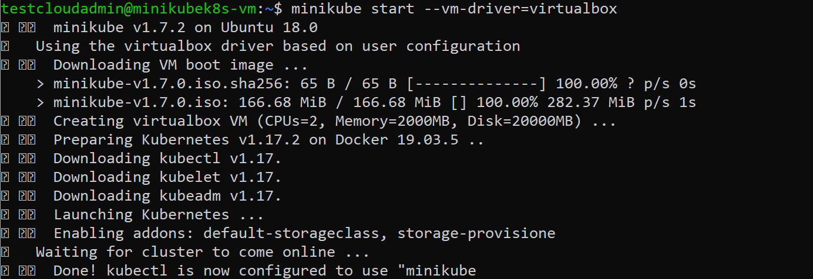
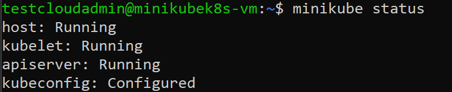
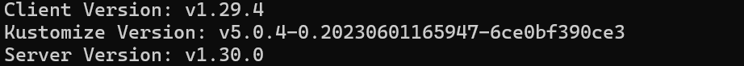
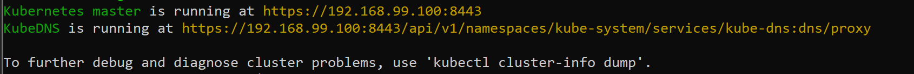

# Playbook Before Part 0 :  How to USE Minikube setting up in Azure VM

##  Prerequsities

Update current packages of the system to the latest version.

    sudo apt update
    sudo apt upgrade

To check if virtualization is supported on Linux, run the following command and verify that the output is non-empty:

    grep -E --color 'vmx|svm' /proc/cpuinfo

## Install VirtualBox on Ubuntu 18.04

Import the Oracle public key to your system signed the Debian packages using the following commands.

    wget -q https://www.virtualbox.org/download/oracle_vbox_2016.asc -O- | sudo apt-key add -
    wget -q https://www.virtualbox.org/download/oracle_vbox.asc -O- | sudo apt-key add -

you need to add Oracle VirtualBox PPA to Ubuntu system. You can do this by running the below command on your system.

    sudo add-apt-repository "deb http://download.virtualbox.org/virtualbox/debian bionic contrib"

Update VirtualBox using the following commands :
   
    sudo apt update
    sudo apt install virtualbox-6.0

## Install Kubectl 

Download the latest release and install kubectl binary with curl on Linux:

    sudo apt-get update && sudo apt-get install -y apt-transport-https
    curl -s https://packages.cloud.google.com/apt/doc/apt-key.gpg | sudo apt-key add -
    echo "deb https://apt.kubernetes.io/ kubernetes-xenial main" | sudo tee -a /etc/apt/sources.list.d/kubernetes.list
    sudo apt-get update
    sudo apt-get install -y kubectl

## Install Minikube

Download a stand-alone binary and use the following command : 

    curl -Lo minikube https://storage.googleapis.com/minikube/releases/latest/minikube-linux-amd64 \
  && chmod +x minikube

Add Minikube to your path 

    sudo mkdir -p /usr/local/bin/
    sudo install minikube /usr/local/bin/

## start Minikube

    minikube start --vm-driver=virtualbox

While starting the minikube, you can see an output similar to the following :

    

You can use the following command to check if Minikube works well :

     minikube status

You can expect an output similar to the following :

    

## Confirmation 

To check out the version of your kubectl, you can use the following command:
    
    kubectl version

You should see the following output:
 
      

To check out the detailed information use the following command:
    
    kubectl cluster-info

You should see the following output:
 
     
